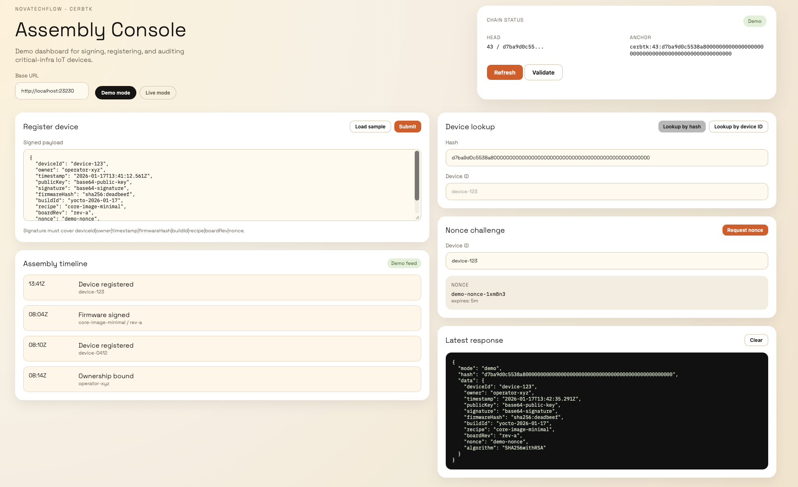

# cerbtk - simple device registry
Demo: IoT device registry for critical infrastructure, built with Kotlin and a simple blockchain log. Supposed as PoC (see credits).

## Threat model and assembly flow

Problem: during hardware and firmware assembly, unauthorized code can be flashed before final QA, leading to permanent compromise.

Demo approach:
1) Firmware build is signed by a trusted keyserver.
2) Assembly line registers the device with a signed payload.
3) The registry verifies the signature and appends an immutable event.
4) Auditors validate the chain or anchor the head hash externally.

This mirrors real-world keyserver controls (e.g., vendor signing services) while keeping the demo lightweight.

## Operational cost and deployment speed (why a shared ledger helps)

This demo does not claim lower raw compute cost. The "cheaper" win is operational: faster onboarding, less reconciliation, and simpler audits when multiple parties touch the device lifecycle.

Typical savings compared to a centralized registry:
- Less partner integration: one shared log and signature format vs per-partner APIs.
- Faster audits: verifiable append-only chain instead of manual log stitching.
- Lower dispute time: immutable event trail for "who signed/when/what".
- Easier rollouts: partners can start by submitting signed payloads, no shared DB access.

It makes sense when you have multiple parties (OEM, ODM, integrator, operator) and high audit burden.

## API

The registration instance is available at http://localhost:23230

## Build and run

Build the fat jar:
```
mvn package
```

Run:
```
java -jar target/cerbtk-jar-with-dependencies.jar
```

Dashboard:
Open `http://localhost:23230/dashboard` for the local UI.



## Configuration

Runtime options (Java system properties):
* `-Dcerbtk.storageEnabled=false` disables persistence to disk (default: true)
* `-Dcerbtk.storagePath=...` sets the chain storage path (default: `data/chain.json`)
* `-Dcerbtk.indexPath=...` sets the device ID index path (default: `data/device_index.json`)
* `-Dcerbtk.crypto.algorithm=...` sets the default signature algorithm for signed payloads (default: `SHA256withRSA`)
* `-Dcerbtk.trustedKeysPath=...` sets the trusted signer public keys file (default: `config/trusted_keys.txt`)
* `-Dcerbtk.nonceRequired=true` enforces nonce challenge validation (default: false)
* `-Dcerbtk.nonceTtlSeconds=...` sets nonce TTL seconds (default: 300)
* `-Dcerbtk.dashboardPath=...` sets the dashboard folder (default: `dashboard`)
* `-Dcerbtk.samplePayloadPath=...` sets the dashboard sample payload (default: `config/sample_payload.json`)

As for now, it offers the following endpoints:
* `GET /device/all` for listing all existing devices in the chain
* `GET /device/{id}` for fetching a device block by hash
* `GET /device/id/{deviceId}` for fetching a device block by device ID
* `GET /device/nonce/{deviceId}` for issuing a one-time registration nonce
* `GET /chain/validate` for verifying chain integrity
* `GET /chain/head` for the latest block index and hash
* `GET /chain/anchor` for a shareable anchor string
* `POST /device/write` for adding new device
* `GET /dashboard` for the local demo dashboard

Device send registration to the chain, gets a block back which is the device ID for all further communication. 
Using a private chain is not tamper proof as an public one, the registration process is just simplified and the 
owner of the chain has the full control.

Blocks are persisted to `data/chain.json` by default. Disable persistence by setting
`-Dcerbtk.storageEnabled=false`, or set a custom path with `-Dcerbtk.storagePath=...`.

Example signed registration payload (POST body):
```
{
  "deviceId": "device-123",
  "owner": "did:example:abc",
  "timestamp": "2026-01-17T10:00:00Z",
  "publicKey": "base64-encoded-public-key",
  "signature": "base64-encoded-signature-over-deviceId-owner-timestamp-firmwareHash-buildId-recipe-boardRev-nonce",
  "firmwareHash": "sha256:...",
  "buildId": "yocto-2026-01-17",
  "recipe": "core-image-minimal",
  "boardRev": "rev-a",
  "nonce": "one-time-nonce",
  "algorithm": "SHA256withRSA"
}
```

Signed payloads are verified if the body is JSON matching the schema above. The signature is computed over
`deviceId|owner|timestamp|firmwareHash|buildId|recipe|boardRev|nonce` using the provided `algorithm` (default
`SHA256withRSA`). Signatures must be verifiable by a trusted public key from `config/trusted_keys.txt` (Base64
X.509 DER, one per line). The `publicKey` field is informational and can be used for device identity, but is
not trusted for verification.

Sample signed payload and key material (ready to use):
- `config/sample_payload.json`
- `config/sample_private.pem` (demo only)
- `config/sample_public.der.b64`
- `config/sample_signature.b64`
- `config/sample_message.txt`

Try it:
```
curl -sS -X POST http://localhost:23230/device/write \
  -H 'Content-Type: application/json' \
  --data @config/sample_payload.json
```

If `cerbtk.nonceRequired=true`, fetch a nonce and sign with it before posting (the sample payload will not pass).

Nonce-enabled registration (auto-sign + submit):
```
BASE_URL=http://localhost:23230 \
DEVICE_ID=device-123 \
OWNER=operator-xyz \
./scripts/register_with_nonce.sh
```

Print a signed payload without posting:
```
DEVICE_ID=device-123 \
OWNER=operator-xyz \
NONCE=demo-nonce \
./scripts/print_signed_payload.sh
```

Regenerate demo keys and payload:
```
./scripts/generate_sample_payload.sh
```

## Yocto integration sketch

If you build firmware with Yocto, you can wire signing into the image build and register during manufacturing.

Suggested flow:
1) Use Yocto signing (e.g., `signing.bbclass` or a custom task) to sign firmware metadata.
2) Embed the device's public key or a factory public key in the image (read-only).
3) Optional: request a nonce from `/device/nonce/{deviceId}` if `cerbtk.nonceRequired=true`.
4) On the assembly line, generate the registration payload and POST to `/device/write`.
5) Store the returned block hash as the device ID for later provisioning.

Minimal payload fields:
```
{
  "deviceId": "<hw-serial-or-uuid>",
  "owner": "<operator-or-oem-id>",
  "timestamp": "<iso8601>",
  "publicKey": "<base64-der-x509>",
  "signature": "<base64-signature-over-deviceId-owner-timestamp-firmwareHash-buildId-recipe-boardRev-nonce>",
  "firmwareHash": "<sha256:...>",
  "buildId": "<yocto-build-id>",
  "recipe": "<yocto-recipe>",
  "boardRev": "<board-revision>",
  "nonce": "<one-time-nonce>",
  "algorithm": "SHA256withRSA"
}
```
Narrative: https://www.novatechflow.com/2026/01/iot-device-manufacturing-needs.html

## Credit

This project uses some open source libraries:
* [Apache Commons Codec](https://github.com/apache/commons-codec)
* [JavaLin](https://javalin.io/)
* [Jackson Module Kotlin](https://github.com/FasterXML/jackson-module-kotlin)
* based on code of [Adrian Marszałek](https://github.com/adikm/kotcoin)
 
